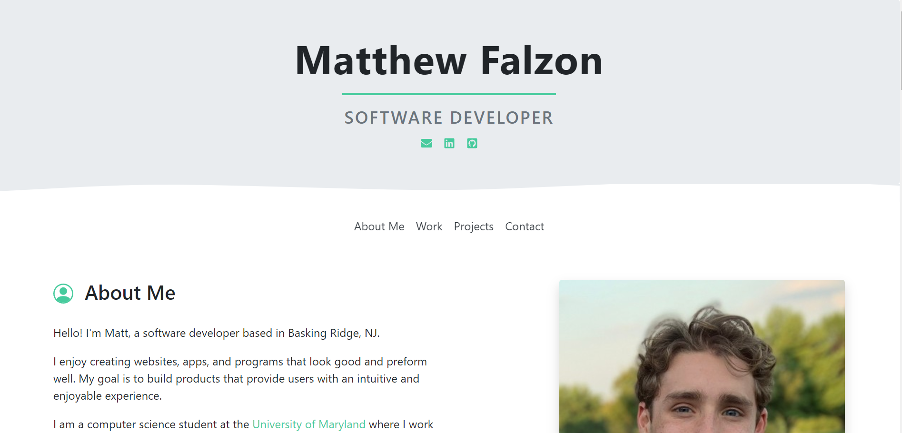

# Portfolio Website

* My portfolio website provides a collection of all relevent information
  an employer might need to know about me!
  
## Features

* **Completely reusable:** All information on the site is taken from a singular
  JSON file, including the colors! Anyone can build their own peronal site within
  minutes using my app
* **Mobile Support:** all devices are supported
  
 
<h2>
     <a href="http://mgfalzon.github.io/student-portal" target="_blank">Visit My Website</a>
</h2>
     

<h4 align="center">Preview</h4>

  

